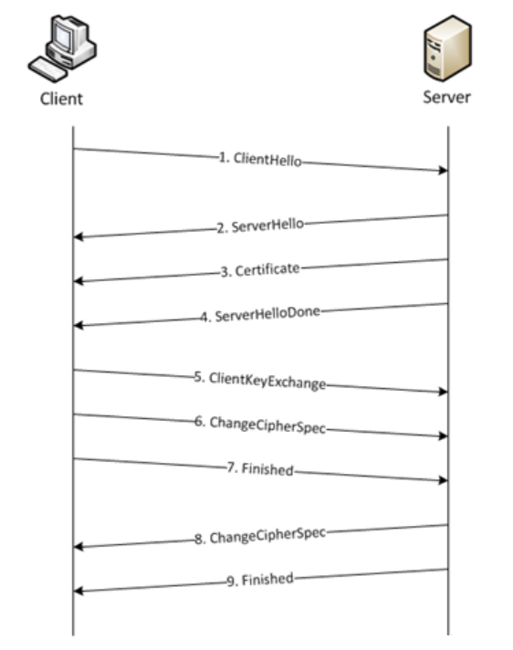
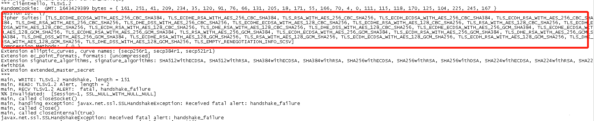
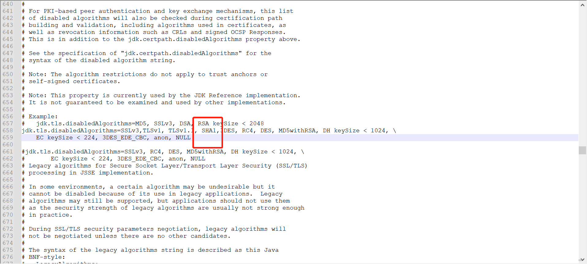

# https请求发生received fatal alert: handshake_failure； nested exception 异常分析和解决方法


调别人的接口，接口要求必须使用https请求，本地对接得好好的，结果一上测试环境每次调用都报异常received fatal alert: handshake_failure； nested exception

翻译过来就是握手失败，本地和测试环境的网络是一样的，应该是测试环境那台主机环境有啥问题。
先回顾一下https四次握手其过程如下：

1. 客户端请求建立连接，发送支持的加密方式以及一个随机数client random给服务器；

2. 服务器选择其中服务端也支持的加密方式，并且再加上另外一个随机数server random，和数字证书（其中有公钥），发送给客户端；

3. 客户端确认这个数字证书是有效的，并且再生成一个新的随机数，将这个随机数用服务器发送给它的数字证书中的公钥进行加密发送给服务器；

4. 服务器收到客户端的回复，利用自己的私钥进行解密，获得这个随机数，然后通过将前面这三个随机数以及他们协商的加密方式，计算生成一个对称密钥。

至此握手阶段完成，之后的会话他们就通过这个对称密钥进行加密传输。  
其中数据包传输过程如下



开始JVM调试模式查看握手过程中的数据传输情况。看看具体哪个步奏异常。
增加如下jvm启动参数开启调试模式查看握手情况。

```java
java -Djavax.net.debug=ssl Main 
```

分别在异常主机和正常主机执行如下代码，填写目标服务器地址，发起https握手。拿结果对比看看哪里不一样

```java
import javax.net.ssl.*;
import java.io.*;
import java.net.URL;

/**
 * @author eduiH
 */
public class Main {

    public static void main(String[] args) throws Exception {
        Main main = new Main();
        System.out.println("---------------------------------------------------------------------");
        main.TestRiQingAPI_SaleOrder();
    }

        public void TestRiQingAPI_SaleOrder() throws Exception {
            String postData = getJson();
            String url = "https://xxxxxxxx/";
            HttpsURLConnection conn = null;
            OutputStream out = null;
            String rsp = null;
            byte[] byteArray = postData.getBytes("utf-8");
            try {
                URL uri = new URL(url);
                conn = (HttpsURLConnection) uri.openConnection();
                //忽略证书验证--Begin
                conn.setHostnameVerifier(new TrustAnyHostnameVerifier());
                //忽略证书验证--End
                conn.setRequestMethod("POST");
                conn.setDoInput(true);
                conn.setDoOutput(true);
                conn.setRequestProperty("Host", uri.getHost());
                conn.setRequestProperty("Content-Type", "application/json");
                out = conn.getOutputStream();
                out.write(byteArray);
                out.close();
                if(conn.getResponseCode()==200) {
                    rsp = getStreamAsString(conn.getInputStream(), "utf-8");
                }else {
                    rsp = getStreamAsString(conn.getErrorStream(), "utf-8");
                }

                System.out.println(rsp);

            } catch (Exception e) {
                if(null!=out)
                    out.close();
                e.printStackTrace();

            }

        }

        /**
         * getJson
         *
         */
        private static String getJson() {
            return "{" + "\"name\"" + ":" + "\"robo_blogs_zh123\"" + "}";
        }

        private static String getStreamAsString(InputStream stream, String charset) throws IOException {
            try {
                Reader reader = new InputStreamReader(stream, charset);
                StringBuilder response = new StringBuilder();

                final char[] buff = new char[1024];
                int read = 0;
                while ((read = reader.read(buff)) > 0) {
                    response.append(buff, 0, read);
                }

                return response.toString();
            } finally {
                if (stream != null) {
                    stream.close();
                }
            }
        }

    class TrustAnyHostnameVerifier implements HostnameVerifier {
        public boolean verify(String hostname, SSLSession session) {
            return true;
        }
    }

}
```

正常输出如下


报错输出如下


由回顾知识知道  
ClientHello—客户端发送支持的加密算法套件CipherSuite  
ServerHello—服务端选择客户端和服务端都支持的加密算法套件CipherSuite  
看正常情况下的报文发现服务端使用的加密算法套件CipherSuite是  
TLS_RSA_WITH_AES_128_CBC_SHA

```
ps:
各个部分含义如下
TLS----使用tls安全协议
RSA----使用RSA非对称加密来传输AES密钥
AES_128_CBC----应用数据使用AES128 CBC模式加密
SHA----摘要算法使用SHA
```

但是在异常的jvm里客户端发送的加密算法套件CipherSuite列表里并不包含该加密套件



```java
ps:
可以看到 ClientHello和ServerHello后面都跟着TLS版本，之前查询网上很多人都说是因为版本不一致问题。
因为JDK8默认使用TLSv1.2 ，JDK7默认使用TLSv1.1。
所以客户端和服务器使用版本不一样也会产生相同的报错信息。
```

不包含那么如何让它包含呢？找网上说什么替换jdk的一些文件就成功等等方案都没效果。  

换个角度想客户端和服务器都是用的jdk8，按道理支持的加密件套应该是一样的，因为标准是一样的，看官网介绍  
<https://docs.oracle.com/javase/8/docs/technotes/guides/security/StandardNames.html#Cipher>
jdk8应该是包含该套件的  


**jdk8有相应的支持，那么加密件套相关的实现代码是存在的，存在但是不可使用，那么应该是在某个地方配置禁用了。**    
直接网上搜索，关键字“*jdk如何禁用一些加密件套*

就在这，jdk安装路劲下  
\jre\lib\security\java.security 图下的这行配置，看长长的注释可以知道这个配置的作用是当觉得某个算法在某个环境中不适用时就可以通过这个配置禁掉，比如安全过低的算法可以禁掉等。可以看到SHA1就是上述服务端需要的算法，被禁掉了，删掉SHA1问题解决。


